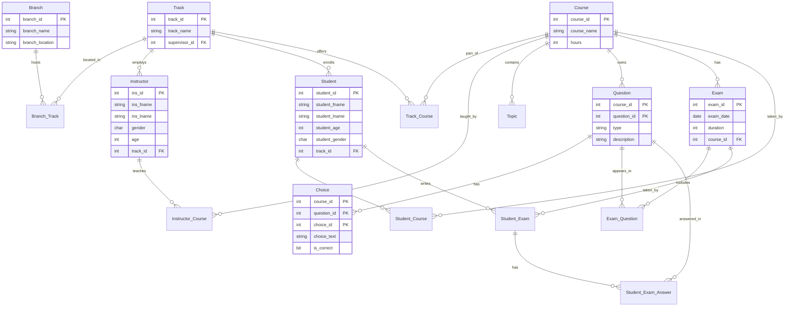
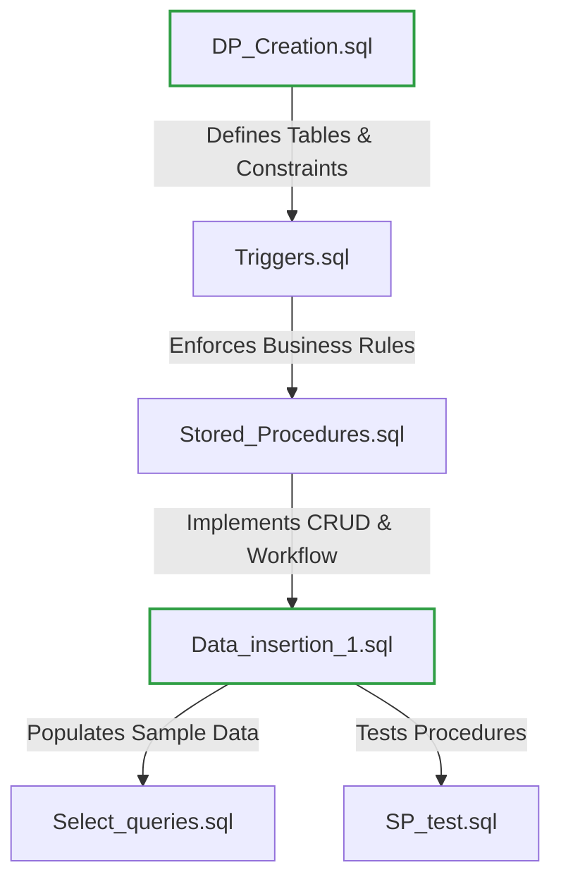
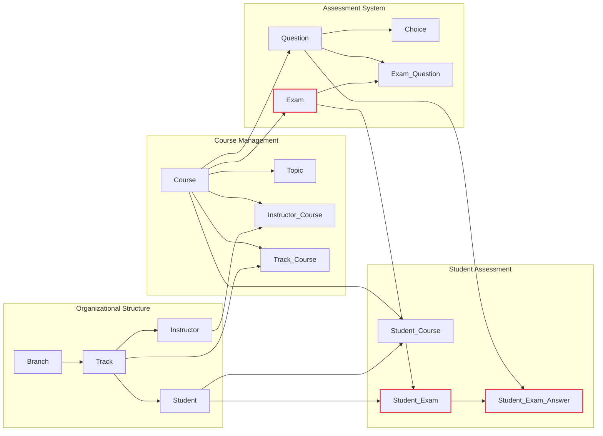

# Examination System Database

A comprehensive SQL Server database project for managing educational examinations, including student enrollment, course management, exam generation, and automated grading.

## 📋 Overview

The Examination System is a relational database designed to handle the complete lifecycle of educational assessments within a training institute environment. It supports multiple branches, tracks, instructors, and students with a robust schema that enforces data integrity through constraints, triggers, and stored procedures. [2](#0-1) 

## 🗄️ Database Schema

### Entity Relationship Diagram



### Key Schema Features

- **Weak Entities**: `Question` and `Choice` tables use composite primary keys including `course_id` to ensure questions are scoped to specific courses [3](#0-2) 
- **Circular Dependencies**: The `Track`-`Instructor` relationship is handled by creating `Track` first with a nullable `supervisor_id`, then adding the foreign key constraint after `Instructor` is defined [4](#0-3) 
- **Data Integrity**: Check constraints enforce age requirements, grade ranges, and question types [5](#0-4) 

## 🚀 Setup Instructions

### Method 1: Database Restoration (Recommended)

1. Locate the backup file at `Backup/ExaminationSystem_Full_Finall.bak`
2. Open SQL Server Management Studio (SSMS)
3. Right-click "Databases" → "Restore Database"
4. Select "Device" and browse to the `.bak` file
5. Click "OK" to restore the complete database with all objects and sample data

### Method 2: Manual Schema Recreation

Execute the SQL scripts in the following order to maintain referential integrity:



**Script Execution Order:**

1. **DP_Creation.sql** - Creates database, tables, constraints, and indexes [6](#0-5) 
2. **Triggers.sql** - Deploys triggers for cross-course validation and supervisor checks
3. **Stored_Procedures.sql** - Implements CRUD operations and exam workflow logic
4. **Data_insertion_1.sql** - Inserts seed data following dependency hierarchy
5. **Select_queries.sql** - Verification queries for data validation
6. **SP_test.sql** - Tests stored procedure functionality

## 📁 Repository Structure

```
ExaminationSystem-Database-FinalProject-ITI/
├── Backup/
│   ├── ExaminationSystem_Full_Finall.bak    # Complete database backup
│   └── Queries/
│       ├── DP_Creation.sql                   # Schema creation script
│       ├── Stored_Procedures.sql             # Business logic procedures
│       ├── Triggers.sql                      # Data validation triggers
│       ├── Data_insertion_1.sql              # Seed data
│       ├── Select_queries.sql                # Verification queries
│       └── SP_test.sql                       # Procedure tests
└── Reports/
    ├── Report1.rdl                           # SSRS report definition
    └── Student_Grades.pdf                    # Sample report output
```

## 🔧 Technical Specifications

### Database Constraints

- **Unique Index**: `UX_Track_Supervisor` ensures an instructor can only supervise one track [7](#0-6) 
- **Check Constraints**:
  - Instructor age must be > 20
  - Student age must be >= 18
  - Grades must be between 0 and 100
  - Question types limited to 'MCQ' or 'TF'

### Performance Indexes

Non-clustered indexes are created on frequently queried foreign key columns:
- `IX_Student_Track`, `IX_Instructor_Track`, `IX_TrackCourse_Track`
- `IX_Exam_Course`, `IX_Question_Course`, `IX_ExamQuestion_Exam`
- `IX_StudentCourse_Student`, `IX_StudentExam_Exam` [8](#0-7) 

## 🎯 Core Functionality

The system supports:
- Multi-branch and multi-track educational management
- Instructor assignment to courses and tracks
- Student enrollment and grade tracking
- Exam generation with MCQ and True/False questions
- Automated exam correction and grading
- Comprehensive reporting through SSRS

## 📝 Data Flow Mapping



## 🛠️ Requirements

- SQL Server 2016 or higher
- SQL Server Management Studio (SSMS)
- (Optional) SQL Server Reporting Services for report generation


---

## Notes

The README was generated based on the available schema definition in `DP_Creation.sql` and the repository structure information from the wiki page. The ERD diagram includes all 13 tables from the schema with their relationships. The mapping diagram shows the script execution order for manual setup and the data flow between major entity groups. Some implementation details like specific stored procedures and trigger logic were not available in the provided context but are referenced in the setup instructions.


### Citations

**File:** Backup/Queries/DP_Creation.sql (L1-236)
```sql
--------------------------------------------------------------
-- DROP DATABASE IF EXISTS
--------------------------------------------------------------
IF DB_ID('ExaminationSystem') IS NOT NULL
    DROP DATABASE ExaminationSystem;
GO

CREATE DATABASE ExaminationSystem;
GO

USE ExaminationSystem;
GO

/* ============================================================
   TABLE: Branch
============================================================ */
CREATE TABLE Branch (
    branch_id       INT PRIMARY KEY,
    branch_name     VARCHAR(50) NOT NULL,
    branch_location VARCHAR(50) NOT NULL
);

--------------------------------------------------------------
-- TABLE: Track
--------------------------------------------------------------
CREATE TABLE Track (
    track_id INT PRIMARY KEY,
    track_name VARCHAR(50) NOT NULL,
    supervisor_id INT NULL
);
GO


CREATE UNIQUE INDEX UX_Track_Supervisor
ON Track(supervisor_id)
WHERE supervisor_id IS NOT NULL;
GO

--------------------------------------------------------------
-- TABLE: Branch_Track (M:N)
--------------------------------------------------------------
CREATE TABLE Branch_Track (
    branch_id INT NOT NULL,
    track_id  INT NOT NULL,
    CONSTRAINT pk_branch_track PRIMARY KEY(branch_id, track_id),
    CONSTRAINT fk_bt_branch FOREIGN KEY(branch_id) REFERENCES Branch(branch_id),
    CONSTRAINT fk_bt_track  FOREIGN KEY(track_id)  REFERENCES Track(track_id)
);


--------------------------------------------------------------
-- TABLE: Instructor
--------------------------------------------------------------
CREATE TABLE Instructor (
    ins_id      INT PRIMARY KEY,
    ins_fname   VARCHAR(50) NOT NULL,
    ins_lname   VARCHAR(50) NOT NULL,
    gender      CHAR(1) CHECK (gender IN ('M','F')),
    age         INT CHECK(age > 20),
    track_id    INT  NULL,
    CONSTRAINT fk_instructor_track FOREIGN KEY(track_id)
        REFERENCES Track(track_id)
);

--------------------------------------------------------------
-- Add supervisor FK (Track must reference Instructor)
--------------------------------------------------------------
ALTER TABLE Track
ADD CONSTRAINT fk_track_supervisor
FOREIGN KEY (supervisor_id) REFERENCES Instructor(ins_id);

--------------------------------------------------------------
-- TABLE: Course
--------------------------------------------------------------
CREATE TABLE Course (
    course_id   INT PRIMARY KEY,
    course_name VARCHAR(50) NOT NULL,
    hours       INT CHECK(hours > 0)
);

--------------------------------------------------------------
-- TABLE: Track_Course (M:N)
--------------------------------------------------------------
CREATE TABLE Track_Course (
    track_id  INT NOT NULL,
    course_id INT NOT NULL,
    PRIMARY KEY(track_id, course_id),
    FOREIGN KEY(track_id) REFERENCES Track(track_id),
    FOREIGN KEY(course_id) REFERENCES Course(course_id)
);

--------------------------------------------------------------
-- TABLE: Instructor_Course (M:N)
--------------------------------------------------------------
CREATE TABLE Instructor_Course (
    ins_id    INT NOT NULL,
    course_id INT NOT NULL,
    PRIMARY KEY(ins_id, course_id),
    FOREIGN KEY(ins_id) REFERENCES Instructor(ins_id),
    FOREIGN KEY(course_id) REFERENCES Course(course_id)
);

--------------------------------------------------------------
-- TABLE: Topic (1 course → many topics)
--------------------------------------------------------------
CREATE TABLE Topic (
    topic_id    INT PRIMARY KEY,
    topic_name  VARCHAR(50) NOT NULL,
    course_id   INT NOT NULL,
    FOREIGN KEY(course_id) REFERENCES Course(course_id)
);

--------------------------------------------------------------
-- TABLE: Student
--------------------------------------------------------------
CREATE TABLE Student (
    student_id      INT PRIMARY KEY,
    student_fname   VARCHAR(50) NOT NULL,
    student_lname   VARCHAR(50) NOT NULL,
    student_age     INT CHECK(student_age >= 18),
    student_gender  CHAR(1) CHECK(student_gender IN ('M','F')),
    track_id        INT NOT NULL,
    FOREIGN KEY(track_id) REFERENCES Track(track_id)
);

--------------------------------------------------------------
-- TABLE: Student_Course (M:N)
--------------------------------------------------------------
CREATE TABLE Student_Course (
    student_id  INT NOT NULL,
    course_id   INT NOT NULL,
    grade       INT CHECK(grade BETWEEN 0 AND 100),
    PRIMARY KEY(student_id, course_id),
    FOREIGN KEY(student_id) REFERENCES Student(student_id),
    FOREIGN KEY(course_id)  REFERENCES Course(course_id)
);

--------------------------------------------------------------
-- TABLE: Exam
--------------------------------------------------------------
CREATE TABLE Exam (
    exam_id     INT PRIMARY KEY,
    exam_date   DATE NOT NULL,
    duration    INT CHECK(duration > 0),
    course_id   INT NOT NULL,
    FOREIGN KEY(course_id) REFERENCES Course(course_id)
);

--------------------------------------------------------------
-- TABLE: Question (weak, course-specific)
--------------------------------------------------------------
CREATE TABLE Question (
    course_id    INT NOT NULL,
    question_id  INT NOT NULL,
    type         VARCHAR(10) CHECK(type IN ('MCQ','TF')),
    description  VARCHAR(200) NOT NULL,
    PRIMARY KEY(course_id, question_id),
    FOREIGN KEY(course_id) REFERENCES Course(course_id)
);

--------------------------------------------------------------
-- TABLE: Choice (weak)
--------------------------------------------------------------
CREATE TABLE Choice (
    course_id   INT NOT NULL,
    question_id INT NOT NULL,
    choice_id   INT NOT NULL,
    choice_text VARCHAR(150) NOT NULL,
    is_correct  BIT NOT NULL,
    PRIMARY KEY(course_id, question_id, choice_id),
    FOREIGN KEY(course_id, question_id)
      REFERENCES Question(course_id, question_id)
);

--------------------------------------------------------------
-- TABLE: Exam_Question (M:N)
--------------------------------------------------------------
CREATE TABLE Exam_Question (
    exam_id     INT NOT NULL,
    course_id   INT NOT NULL,
    question_id INT NOT NULL,
    PRIMARY KEY(exam_id, course_id, question_id),
    FOREIGN KEY(exam_id) REFERENCES Exam(exam_id),
    FOREIGN KEY(course_id, question_id)
      REFERENCES Question(course_id, question_id)
);

--------------------------------------------------------------
-- TABLE: Student_Exam (M:N)
--------------------------------------------------------------
CREATE TABLE Student_Exam (
    student_id  INT NOT NULL,
    exam_id     INT NOT NULL,
    total_grade INT CHECK(total_grade BETWEEN 0 AND 100),
    PRIMARY KEY(student_id, exam_id),
    FOREIGN KEY(student_id) REFERENCES Student(student_id),
    FOREIGN KEY(exam_id)    REFERENCES Exam(exam_id)
);

--------------------------------------------------------------
-- TABLE: Student_Exam_Answer
-- dependent on Student_Exam
--------------------------------------------------------------
CREATE TABLE Student_Exam_Answer (
    student_id  INT NOT NULL,
    exam_id     INT NOT NULL,
    course_id   INT NOT NULL,
    question_id INT NOT NULL,
    stud_answer VARCHAR(255),
    is_correct  BIT,
    PRIMARY KEY(student_id, exam_id, course_id, question_id),
    FOREIGN KEY(student_id, exam_id)
      REFERENCES Student_Exam(student_id, exam_id),
    FOREIGN KEY(course_id, question_id)
      REFERENCES Question(course_id, question_id)
);


CREATE NONCLUSTERED INDEX IX_Student_Track ON dbo.Student(track_id);
CREATE NONCLUSTERED INDEX IX_Instructor_Track ON dbo.Instructor(track_id);
CREATE NONCLUSTERED INDEX IX_TrackCourse_Track ON dbo.Track_Course(track_id);
CREATE NONCLUSTERED INDEX IX_TrackCourse_Course ON dbo.Track_Course(course_id);
CREATE NONCLUSTERED INDEX IX_Exam_Course ON dbo.Exam(course_id);
CREATE NONCLUSTERED INDEX IX_Question_Course ON dbo.Question(course_id);
CREATE NONCLUSTERED INDEX IX_ExamQuestion_Exam ON dbo.Exam_Question(exam_id);
CREATE NONCLUSTERED INDEX IX_StudentCourse_Student ON dbo.Student_Course(student_id);
CREATE NONCLUSTERED INDEX IX_StudentExam_Exam ON dbo.Student_Exam(exam_id);
GO
	
```
